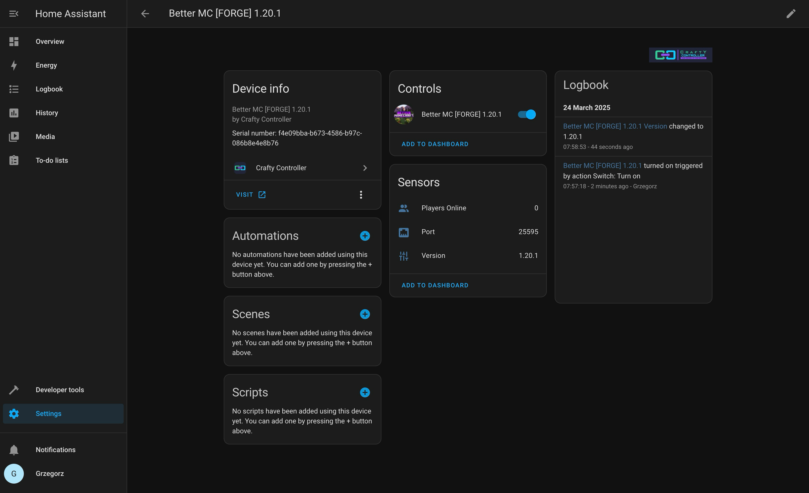
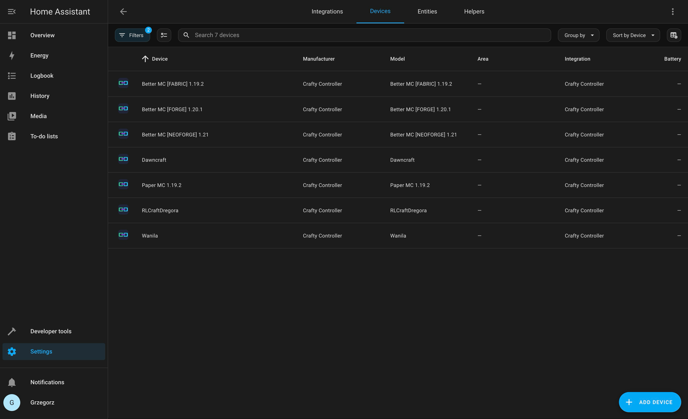

# Crafty Controller integration for Home Assistant

Control you minecraft servers (on/off) and monitor statistics.

## Installation
1. **Add the Custom Repository to HACS:**

   - Open Home Assistant and navigate to **HACS**.
   - Click on **Integrations**.
   - Click on the three dots in the top-right corner and select **Custom repositories**.
   - In the dialog that appears:
     - **Repository URL**: `https://github.com/Gregman-js/crafty-controller-hass-integration`
     - **Category**: **Integration**
   - Click **Add**.
   - You should see a confirmation that the repository was added successfully.

2. **Install the Integration:**

   - In HACS, go back to **Integrations**.
   - Click on the **Explore & Add Repositories** button.
   - Search for **Crafty controller**.
   - Click on the **Crafty controller** integration.
   - Click **Download** in the bottom right corner.
   - Confirm the installation by clicking **Download** again.
   - Restart Home Assistant if asked.
  
3. ** Add Integration to Devices & Services:**

   - In the Home Assistant Settings menu, select **Devices & Services**.
   - Tap the **+ Add Integration** button.
   - Search for **Crafty controller** and select it.
   - Fill form and click **Submit**.
   - This should now show as successfully configured.
   - Tap **Finish**.

## Examples
### Minecraft server instance page

### Devices(server instances) lists


## Development
Add this to home assistant core devcontainers:

Remember to replace `$(pwd)` with this project absolute path
```json
{
  "mounts": [
    "source=$(pwd)/custom_components/crafty_controller,target=/workspaces/ha-core/config/custom_components/crafty_controller,type=bind,consistency=cached"
  ]
}
```

Add `"--network=host"` to `runArgs`